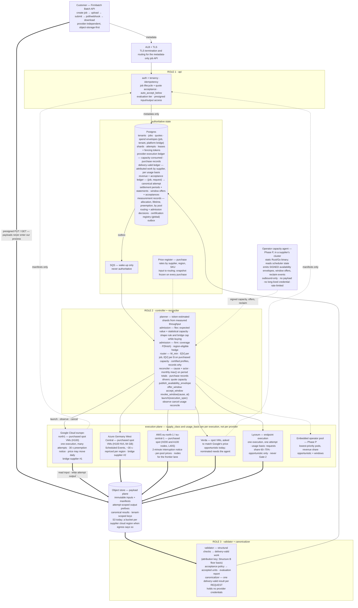

# Firmbatch v1 — target architecture (rev D, Phase 0 supply and the purchased class)

Status: **PLANNED**. Nothing here is implemented; `docs/STATE.md` remains the record of what is.
Companion PDF: `firmbatch_v1_target_architecture_4.pdf`.
Settlement wording is canonical in `settlement-model-r1_3.md` (Amendment 4) — if this file and that
one disagree, that one is right. Companions: plan v3.4, roadmap r2_4, RFQ revision 2 (and the
endpoint variant), the operator's equation paper (revision 2), and `gpu_price_register_1.xlsx`.

Rev B replaced the OpenAI-compatible customer edge with a native, provider-independent job API.
Rev C resolved the settlement contradiction (a revenue share and "no acceptance risk" cannot both
hold), split supply into classes with different accounting, and made window admission and routing
explicit. Rev C.1 added the operator capacity agent as a third deployable artifact, the three
ledgers named separately, the commercial fields frozen on every attempt, the window state machine,
and a cause enum with an asserting party.

**Rev D (6 September 2026) follows plan v3.4's Phase 0.** v1 runs first on capacity we *buy* —
hyperscaler spot in Finland, Frankfurt and Stockholm, with Verda asked to match — and without an
operator agent, which moves behind the supplier signature. That changes what v1 is made of, not what
it is. Rev D adds: a fourth supply class, **purchased spot**, with its own frozen fields and a
platform-level **bridge envelope**; a **cost term in routing** while capacity is bought; the three
hyperscaler spot **drivers** and their reclaim semantics; Gate 1's **measurements as first-class
records**; a **usage basis** per supply class, so endpoint supply (60–75% of NCR, settled per
request) can be settled at all; **node-level windows and multi-GPU executions** for whole-node
residual and the frontier-model lane; **measured throughput and W_min inputs** in the certification
registry; the **evaluation tier**; `auto_accept_below` decided in favour; an optional **provider
policy**; cross-cloud egress in the cost table; and the firm tier's definition aligned with the
plan. The attempt / delivery-valid / accepted-unit split, the ledgers and the settlement formulas
do not change.

**Three deployable artifacts, two of them in Phase 0.** The control plane is one Python image
running three roles. The **execution worker** is a separate signed, digest-pinned OCI image
carrying the Python/CUDA runtime; in Phase 0 it runs on VMs we rent. The **operator capacity agent**
is a separate static binary that runs in an operator's cluster; it is built when a supplier signs
(roadmap Phase P) and is a target artifact here, not a Phase 0 one. Conflating the three is how "a
static binary with no runtime" ends up describing something that is neither.

The core unit is an immutable **attempt**. The commercial unit is an **accepted unit**.
**Delivery-valid work** says which supplier produced an accepted unit, and is what a Structure B
floor is paid on. Those three are deliberately not the same thing.

> The customer buys a completed, validated batch job. Firmbatch decides where and how it executes.



## Customer API

```text
POST   /v1/jobs                          create draft, return presigned upload information
POST   /v1/jobs/{job_id}/submit          inputs are uploaded; begin validation
POST   /v1/jobs/{job_id}/accept-quote    accept the immutable quote (skipped when auto_accept_below covers it)
GET    /v1/jobs/{job_id}                 state, progress, forecast
POST   /v1/jobs/{job_id}/cancel
GET    /v1/jobs/{job_id}/results         presigned download of results and errors — and, for evaluation jobs, the report
```

```text
draft → uploaded → validating → quoted → admitted → running → finalizing
      → completed | partial | failed | cancelled

evaluation tier:   draft → uploaded → validating → admitted → running → finalizing → completed
                   (no quote; admitted under the evaluation cap; produces a report, not an invoice)
```

### Canonical JobSpec

```json
{
  "input": { "format": "jsonl" },
  "model": { "id": "Qwen/Qwen3-8B-Instruct", "runtime_profile": "vllm-fp8" },
  "service_tier": "flex",
  "deadline": "2026-09-13T18:00:00Z",
  "acceptance_policy": { "id": "policy_17", "version": 3 },
  "region_policy": ["EU"],
  "provider_policy": { "exclude": [] },
  "auto_accept_below": { "amount": 120.00, "currency": "USD" },
  "output": { "format": "jsonl" },
  "idempotency_key": "customer-run-482"
}
```

There is deliberately **no provider field**. The customer expresses *what* and *by when*, never
*where* — that is the abstraction being sold. The JSONL inside the input file may carry
OpenAI-style request bodies (`messages`, `temperature`, `max_tokens`, `response_format`), so a
customer's per-request code is unchanged; only the job envelope is ours.

`acceptance_policy` is frozen and version-stamped at admission. That is not a convenience: under a
revenue share the supplier's payment depends on it, so it cannot be changeable after work is done.

`service_tier` is `flex` (the pilot), `firm` (built, dark — see below) or `evaluation`: the free
1,000-request evaluation the customer brief sells. An evaluation job has no quote and produces no
invoice; it is admitted under its own cap, runs on the same supply, and returns a report — pass rate
against the customer's own rules, the escalation rate the demand map calls x, and cost per thousand
accepted units at list. It is the sales motion, so it is a job type, not a special case.

`auto_accept_below` is **decided, in favour** (it was an open item in rev C). The quote stays
contractual and immutable; a job whose quote comes in under the customer's stated amount is admitted
without the round trip. Phase 0's paying customers are recurring jobs quoted against their invoice,
and a human handshake on every run is exactly the friction that loses them.

`provider_policy` is optional and names *whose*, never *where*: a customer may exclude a provider
class or a named subprocessor — an EU region on a US-owned cloud is acceptable to many EU buyers and
not to all — and the default is every certified provider inside `region_policy`. It exists because
Phase 0 runs on Google, Microsoft and Amazon, and all three sit on the subprocessor list from the
first paid job. It is a constraint on routing, not a placement, so the abstraction survives it.

## Settlement — the rev C change, unchanged in rev D

Two statements were being made together and cannot both be true: that the supplier takes 20% of
collected revenue, and that the supplier carries no acceptance risk. If a structurally valid result
is rejected by the customer's policy, there is no collected revenue to share.

```text
Structure A   P_i  =  20% × NCR_i
Structure B   P_i  =  max( f × delivery-valid GPU-hours_i ,  20% × NCR_i )
```

`max`, never `floor + share` — and the max is taken **once per settlement month, on totals**:

```text
correct    P_o,T = max( f_o · H^DV_o,T , Σ_{u∈T} s_u · NCR_u ) + C^cancel_o,T
wrong      P_o,T = Σ_h max( f_o · H_h , 0.20 · NCR_h )
```

The share leg is a **sum of per-unit shares**: `s_u` is 0.20 on opportunistic units, 0.25 or 0.30
on nominated ones, and 0.60–0.75 on endpoint units — all can occur inside one period. The
cancellation credit sits **outside** the max — it compensates execution that produced nothing,
applies only to execution since the last committed result, and therefore never overlaps the hours
already inside `H^DV`. Structure A is the `f = 0` case of the same expression, which is why one
reconciler implements both. Purchased and endpoint classes carry no floor: the floor leg is
undefined on them, and the reconciler treats them as `f = 0`.

**Every attempt carries, frozen when the work runs:** `operator_id`, `contract_version`,
`supply_class`, `usage_basis`, `window_offer_id`, `share_bps`, `floor_rate`,
`delivery_valid_gpu_seconds` (or `delivery_valid_requests`, per the usage basis),
`cancellation_cause`, `cancellation_actor` — and, on purchased executions, `supplier_account` and
`purchase_rate`. `share_bps`, `floor_rate` and `purchase_rate` are snapshots of the terms in force at
that moment; without them a renegotiation silently re-prices every historical settlement, and a
supplier that reprices spot daily (Google may) leaves no auditable cost behind.

Because `Σ max(a,b) ≥ max(Σa, Σb)`, the per-hour form takes the floor in every weak hour and the
share in every strong one, and systematically overpays. The reconciler aggregates first and compares
once. **Net Collected Revenue** is amounts collected for accepted units, less refunds and credits on
those units, less payment fees and transaction taxes — and nothing else. `R_c` is measured —
`NCR / H^DV` — not derived, and every headline figure in these documents is the `η_accept = 1.0`
case. Full table in `settlement-model-r1_3.md`; the architectural consequences are:

- The output ledger `(job_id, request_id) → canonical attempt_id` — carrying acceptance status and
  acceptance-policy version — is the **attribution key** for payment, not just a deduplication
  record. Per request, never per job. *Canonical*, not *winning*: a structurally valid canonical
  result can still be rejected by the customer's policy and produce no Structure-A revenue.
- Every cancellation row carries exactly one **cause** from a closed enum, each defined by evidence
  both sides can see rather than by intent:

  ```text
  unpaid     operator_reclaim · operator_blackout · platform_failure
  payable    firmbatch_reroute · firmbatch_routing_error · firmbatch_envelope
             firmbatch_sibling_won · firmbatch_deadline_abandoned
             customer_cancelled · lease_expiry · unattributed
  by actor   security_stop — ours pays, operator-asserted does not
  ```

  On purchased executions the same enum records *why* an execution ended, but nothing is payable to
  anyone: a hyperscaler's preemption is `operator_reclaim` with the cloud as the asserting party, and
  it is a measurement, not a settlement event.

  Every cause also records **who asserted it**. That is what makes `security_stop` settleable: the
  same event pays or does not depending on which side stopped it, and that is a fact one side can
  evidence. A separate column records whether the cause **revokes an accepted window** — only the two
  operator-side causes do, because a cancellation of ours inside a nominated window does not cost the
  supplier a premium it earned by honouring the window.

  **`unattributed` pays.** A termination no record explains is payable at the quoted rate `f_c` —
  the only default an operator will sign, and it puts the burden of instrumenting the boundary on
  the party that can fix it. Its share is a reported defect metric, not an accepted cost. The cause
  field without a quoted `f_c` records disputes without resolving them, so both are required.
- Under Structure B, delivery-valid hours from an attempt that *lost* canonicalisation still count
  toward the floor. We chose to run it twice, so we pay for it — which correctly makes our own
  redundancy expensive to us.
- Collection state must be tracked per invoice, because Structure A pays on collected revenue and
  Structure B does not.

## Supply classes

| Class | Share of NCR | Usage basis | Commitment | Routing |
|---|---|---|---|---|
| Opportunistic residual | 20% | GPU-seconds | none either side | default on shared capacity |
| Accepted nomination | 25% | GPU-seconds | operator holds the window; we accepted it only because we had work | `W ≥ W_min`, certified profile, permitted region |
| Accepted nomination, stronger terms | 30% | GPU-seconds | binding notice, certified profile, permitted region, persistent artifact cache, completion distribution above threshold | eligible for deadline-bearing work |
| **Purchased spot (Phase 0 bridge)** — new in rev D | n/a — cost of goods, no counterparty payable | GPU-seconds, billed by the supplier | none; bought only against admitted jobs, inside the bridge envelope | E[V] per dollar; shape rule at admission; shared capacity first whenever both exist |
| **Endpoint supply (S5)** — new in rev D | 60–75%, or a per-token price | accepted requests / tokens, from the supplier's usage records, with a drop signal | none; the supplier drops us when latency traffic arrives | opportunistic only; a permitted fast lane that never passes Gate 2 |
| Completion hedge | n/a — ordinary firm terms | GPU-seconds | a firm purchase from a job's capped hedge budget | outside the residual contract; never in the operator RFQ |

`supply_class` on an execution is therefore one of `opportunistic`, `accepted_honoured`,
`accepted_revoked`, `purchased`, `endpoint`, `hedge`; delivery-valid work is tagged as it is
produced, and only `accepted_honoured` earns the step-up. `usage_basis` is `gpu_seconds` on
everything but the endpoint class, where it is `requests`. The delivery-valid ledger keys on the
basis, so an endpoint supplier's statement lists accepted requests and their revenue, never hours it
does not have.

The premium **vests only on an honoured window**. A revocation inside an accepted window drops that
window's completed work back to 20%; nothing carries forward. An unfilled nomination costs us no
cash — 25% of zero is zero — so eligibility gating exists to protect the supplier from nominating
capacity we cannot route, not to protect our cash.

A nomination is two-sided, so `nominate()` is the wrong interface: it hides who moved.

```text
publish_availability_envelope(...)   supplier — standing shape, not a commitment
offer_window(...)                    supplier — a bounded offer; earns nothing, commits nobody
accept_window(...)                   Firmbatch — explicit, and only against admitted or forecast
                                     work. Premium eligibility begins here, not at the offer.
revoke_window(cause, effective_at)   either side, with a recorded cause

offered ──→ accepted ──→ active ──→ honoured      premium vests
   │                          └──→ revoked        base share, nothing carried forward
   ├──→ rejected                                  costs neither side
   └──→ expired                                   costs neither side
```

**Accepting a window snapshots** the certified GPU class and runtime profile, region, the **unit —
card or whole node — and the GPU count and NVLink topology when it is a node**, capacity count,
start and expiry, minimum usable window, notice period, required cache state, share step-up in basis
points, and contract version. Eligibility is evaluated once against the terms as offered and then
fixed — otherwise a supplier could offer capacity that is unusable by settlement and still claim the
premium, or we could tighten the rule after the fact. `honoured` describes the supplier's conduct,
not our utilisation: if we accept a window and fail to fill it, it is still honoured and earns the
step-up on whatever revenue it produced, which may be nothing.

Two of the RFQ's questions land here. **Whole nodes (T8):** a residual that arrives as an NVLink
node can be nominated as a node window and filled by one multi-GPU execution; single cards are what
v1 runs, so a node window is admitted only for a certified multi-GPU profile. **Capacity calendars
(T9):** a known idle block is an offer with a future start, and calendar slippage is already priced
by the revocation rule, so a schedule that moves costs the supplier nothing beyond the premium on
that window.

**These calls need the operator capacity agent, or an equivalent capacity endpoint the operator
exposes itself.** Through a provisioning API alone we see prices and availability but not the
scheduler, so an API-only supplier — every hyperscaler, and Verda today — is opportunistic or
purchased supply only, and the 25–30% tier is not reachable. That is the fork to settle with Verda
when the RFQ is walked in, not after.

A window that was never accepted is ordinary opportunistic residual at the base share, whatever the
supplier intended by offering it.

## Phase 0 — bought capacity: drivers, envelope, records

New in rev D. Plan v3.4 runs the first paying jobs on capacity bought where the residual is
cheapest — Google's europe-north1 first, then Azure Germany West Central and AWS Stockholm or
Frankfurt, with Verda asked to match Google's price once an invoice exists — and retires the bridge
job by job when share-priced capacity arrives. Three things have to exist for that, and none of them
was in rev C.

**Drivers.** The provider contract is unchanged — `quote / capacity`, `launch(execution_spec)`,
`observe`, `cancel`, `usage`, `reconcile` — and the set of implementations grows by three spot APIs
whose reclaim semantics differ:

| Driver | Reclaim signal and notice | Lifetime and stockout | Price | Execution model |
|---|---|---|---|---|
| Google Compute Engine, Spot | preemption notice on the metadata server, ~30 s; instance stopped | no maximum lifetime; `ZONE_RESOURCE_POOL_EXHAUSTED` on create — spread across zones a/b/c and record it | set per region and family, may change daily; snapshotted at launch | one VM, many attempts; `a3-highgpu-1g` single H100 |
| Azure, Spot VMs | Scheduled Events `Preempt`, ~30 s; eviction policy deallocate or delete (choose delete) | no maximum; allocation failures and quota per region; repriced per region (most H100 NVL pools on 1 Sep 2026) | per region and SKU; snapshotted at launch | one VM, many attempts; `NC40ads_H100_v5` single H100 NVL |
| AWS EC2, Spot | interruption notice via IMDS, 2 min, plus a rebalance recommendation | capacity per pool per zone; `InsufficientInstanceCapacity`; prices per pool | per instance pool, moves continuously; snapshotted at launch | single-card sizes (`g6e.4xlarge`) and whole nodes (`p5e`, `p4d`, `p6-b300`) — the frontier lane |
| Verda, spot | eviction with refund-on-eviction billing (verified) | availability flag per location | posted, a flat 50% of on-demand | one VM, many attempts |
| Lyceum, endpoint | a drop signal per request | quota and queue time, capacity opaque | per token or a share | one execution, one attempt; usage basis requests |

`E[tail]` takes the notice and the commit interval per driver; nothing else in routing knows which
cloud it is on.

**The bridge envelope.** Beside the per-job and per-tenant envelopes there is one platform-level
envelope for purchased capacity: a monthly cap on GPU spend net of billings, a total cap, a
sub-cap per supplier account, and the rule that a purchase is launched only for an admitted job —
never ahead of demand. Admission enforces the plan's shape rule on purchased capacity (input-heavy
work first; every shape clears at Google's Finland price, only input-heavy work at neocloud
prices, and the rule is the margin of safety on the cheaper supply and the constraint on the dearer)
and every job carries `movable_to_shared`, the flag that lets its remaining work move to
share-priced capacity the day a supplier contract exists. A bridge that is still the supply at month
twelve is the merchant model wearing a bridge's clothing, and the envelope is where that is made
impossible rather than merely unwise.

**Purchase records.** Every purchased execution writes, at launch and immutably: `supplier_account`,
region and zone, SKU, `purchase_rate` in force when it started, and at termination the billed
seconds and the supplier's own price at that moment. The provider-execution ledger already records
capacity consumed; the purchase record is what turns it into a cost the bridge envelope can be
reconciled against and a per-job cost the quote can be checked against.

**Measurement records.** Gate 1 now decides where the bridge buys, and — because the same numbers
say whether Finland's cheap spot is surplus or a hot region's junk — whether the supply thesis holds
for Finnish operators. So the controller records, per pool (supplier, region, zone, SKU) and as
first-class rows rather than logs: allocation attempts and grants, time to grant, stockouts,
instance lifetime before reclaim as P10/P50/P90, preemptions per day and their hour-of-day shape,
the notice actually observed, model-load time warm and cold, and `η_delivery`. These feed `E[tail]`
and `E[V]`, they are the figures RFQ §1 quotes back to an operator we already buy from, and they
are the decision rule in the plan: a median lifetime above an hour with a few preemptions a day
confirms the surplus reading; a median near W_min, or repeated stockouts, moves the bridge to the
next supplier.

**Cost in routing.** `E[V]` is right for shared capacity, whose hours cost us nothing. On purchased
capacity the router scores expected delivery-valid work *per dollar* — cost is `purchase_rate /
η_delivery` for that pool plus the egress the placement implies — with the price register as its
input and the rate snapshotted on the purchase. When shared and purchased capacity both exist, shared
goes first. The same H100 is $1.14 an hour in Hamina and $6.80 in Frankfurt on the same day, so a
router without a cost term would be indifferent between a bridge that clears every job shape and one
that clears none.

## Window admission and routing

```text
W_min  =  ( L_load + E[tail] + L_other ) / ( 1 − η_min )
```

| Case | L_load | E[tail] | L_other | η_min | W_min |
|---|---|---|---|---|---|
| Artifact cache persists on the node | 45 s | 60 s | 0 | 0.80 | **8.8 min** |
| Same, tolerating a worse efficiency | 45 s | 60 s | 0 | 0.70 | 5.8 min |
| Same, plus per-window overhead | 45 s | 60 s | 60 s | 0.80 | 13.8 min |
| **No cache — model pulled each time** | 8 min | 60 s | 0 | 0.80 | **45.0 min** |
| Frontier single card (~170 GB, e.g. DeepSeek V4 Flash on one B300) from a local NVMe cache | 2 min | 60 s | 0 | 0.80 | 15 min |
| Same, weights pulled from object storage at ~1 GB/s | 3.5 min | 60 s | 0 | 0.80 | 22.5 min |
| Frontier node (~1.4 TB, e.g. Kimi K3 on 8×B300) from local NVMe at ~2 GB/s | 12 min | 60 s | 0 | 0.80 | 65 min |
| Same, from object storage at ~1 GB/s | 24 min | 60 s | 0 | 0.80 | **125 min** |

Without a persistent artifact cache a window must be five times longer before it is worth entering,
and most residual windows are not. That is why cache persistence and the free-window distribution
are the two highest-value answers in the operator RFQ. The four large-model rows are planning
figures, not measurements: they say that on the frontier lane a persistent local copy of the weights
is a precondition rather than a preference, that a preempted node costs an hour of loading rather
than a minute, and that short spot windows are useless to it — which is why that lane is Phase B.

**Routing is per job, not per provider.** A static provider score ranks pools on the mean, and the
mean does not separate them: pool A (400 GPUs, η_delivery 0.55) produces 66,000 delivery-valid hours
a month against pool B's 55,200 (200 GPUs, η 0.92), and A is also faster per wall-clock hour, 220
against 184. A wins on both. What separates them is variance and tail. So the router scores
`E[V_i]` — expected delivery-valid work for *this* job on candidate placement *i*, conditioned on
shard size, model residency, region policy and remaining slack — and a deadline-bearing job routes
on the low quantile while a slack flex job routes on the mean. On purchased capacity it scores
`E[V_i] / cost_i` (above).

Per-provider commit granularity (commit interval, notice, re-imaging) enters `E[tail]`, and
therefore both `W_min` and `E[V]`. It is an input, not a separate reliability adjective.

**Multi-GPU executions.** `execution_spec` carries `gpu_count`, the parallelism (tensor, expert)
and the node class; the certification registry is keyed on them, so a profile certified on one
H100 says nothing about the same model on eight B300s. v1 runs single cards. Node executions exist
for two reasons — whole-node residual nominated under T8, and the frontier lane, where a model of
280 billion parameters fits one B300 and one of 2.8 trillion needs a node — and they are Phase B.

## The six structural corrections (rev B, unchanged)

| # | Correction | Where it lands |
|---|---|---|
| 1 | Native, object-storage-first job API | Customer edge. Presigned URLs on both ends, so "payloads never enter the API, the scheduler, the database or the logs" is literally true. ALB is a plain ECS routing choice. |
| 2 | Transactional outbox | Postgres. State change and event in one transaction; SQS only wakes processes. |
| 3 | Abstract executions, not workers | `launch(execution_spec)` with a separate attempt→execution binding, so one-execution-many-attempts (VMs) and one-execution-one-attempt (endpoints) sit behind the same interface. |
| 4 | Three accounting records | Provider execution work ≠ delivery-valid work ≠ customer-accepted units. |
| 5 | Certification registry as a routing gate | Keyed by model digest, runtime image digest, runtime version, precision, GPU class, GPU count and parallelism, provider, region. Global, not tenant-scoped. Since rev D it also holds the measured prefill and decode throughput of the profile and its W_min inputs (load time with and without a cache), because the planner's shard sizing and every quote depend on a number Gate 1 produces rather than the 10,000 tokens-a-second placeholder. |
| 6 | Spend envelope per admitted job | Written at admission, enforced by the router. Includes cumulative launches, wall-clock kill-by, a per-tenant aggregate, and the hedge budget — and, since rev D, the platform-level bridge envelope above it. |

## Efficiency, split in two

```text
η_delivery  =  delivery-valid attributed work  /  provider execution work
η_accept    =  customer-accepted units         /  delivery-valid units
```

`η_delivery` is an engineering number — fencing, recovery, cold starts, redone work. `η_accept` is a
product number — model fit, prompt quality, policy strictness. Neither is a payment base on its own.
Collapsing them hides which side a bad month came from. On purchased capacity `η_delivery` is also a
direct cost: at 0.7 instead of 0.9 the bridge's cost per delivery-valid hour rises from $1.45 to
$1.81 on Google's Finland price and from $2.29 to $2.89 on neocloud spot.

We do not quote an `η_delivery` figure to a supplier before the pilot has produced one. What is
offered instead is a target, monthly reporting of the realised number, and automatic suspension of
routing when the rolling figure falls below the agreed threshold — and, since Phase 0, the number we
measured on their own spot tier as their customer.

## Non-negotiable in v1

- Every **tenant-owned authoritative row** and every object-store key carries `tenant_id`. Shared
  provider and certification reference records are explicitly global.
- Execution `security_domain = tenant_id + model-artifact classification + region`. One execution
  never concurrently serves two tenants. The cost is packing density — a deliberate trade of
  utilisation for isolation, and it belongs in the cost model. On a node-class execution the cost is
  eight times larger, and the frontier lane's prices carry it explicitly.
- Workers get one-time registration credentials exchanged for short-lived scoped tokens. The shared
  `FB_TOKEN` does not survive into v1 (closes D3, D4; a Gate 2 precondition). Supplier credentials
  are one least-privilege service account per cloud and per supplier account, held by the controller
  only.
- Attempt outputs are immutable and attempt-scoped. A retry never overwrites a retry.
- A settle is rejected unless attempt ID and fencing token match the current lease (closes D1).
- The canonicalizer promotes exactly one delivery-valid result **per request**. Requests within one
  shard may be won by different attempts; the ledger key is `(job_id, request_id) → attempt_id`.
- Every cancellation row carries a cause. There is no unattributed termination.
- **No speculative duplication.** A second attempt on a request is launched only after the first is
  confirmed lost, or when the deadline forecast breaches. Duplication for its own sake is a cost we
  pay for under Structure B, a direct cost on purchased capacity, and a supplier-relations problem
  under both.
- **No purchase without an admitted job, and none outside the bridge envelope.** `purchase_rate`
  and `supplier_account` are frozen on every purchased execution. Evaluation jobs spend the bridge
  under their own cap and are counted against it.
- The `validator + canonicalizer` role holds no provider credentials — the component parsing
  untrusted model output is not the component that can spend money.
- The firm tier — a customer-named deadline shorter than 72 hours with a 24-hour minimum, from
  Phase B — is built but flagged off. It turns on when the same workload has survived measured
  provider loss and cross-provider recovery — a release gate, not an architecture change.

## Costs this design makes visible

| Line | Why it matters |
|---|---|
| Object-store egress to providers | A budgetary estimate of roughly $0.09/GB from S3, dependent on region and route; the current rate must be recorded in the price register. Paid again on every re-run after preemption, so it scales with interruption rate, not only volume. |
| Cross-cloud egress on the bridge — new in rev D | The payload plane is on S3 and Phase 0's workers run in Google's and Microsoft's clouds, so input-heavy jobs pay cross-cloud egress on every input fetch and every re-run. The mitigation is a bucket per supplier cloud region behind the same presigned-URL interface, adopted when the bridge's egress bill says so, not before. |
| The bridge cost itself | Purchased capacity costs `purchase_rate / η_delivery + o_ctrl` per delivery-valid hour — $1.45 on Google's Finland spot, $2.29 on neocloud spot — against $0.49–0.76 on share-priced capacity. Reported monthly against the envelope. |
| The acceptance gap | Delivery-valid work the customer's policy rejected. Under Structure A the supplier shares it proportionally; under Structure B we absorb it up to the floor; on purchased capacity we absorb all of it. It is a different number in each case and must be reported either way. |
| The hedge premium | The only line that may pay for availability rather than output. Capped inside an admitted job's envelope, priced into that job's quote. An EU-pinned job can only be hedged on EU-certified capacity, so liquidity is thinnest where the first customers are. |
| Isolation over density | One execution per tenant means small jobs cannot share a card — or, on the frontier lane, a node. |
| Our own redundancy | Under Structure B, a losing duplicate attempt is still paid for; on purchased capacity it is paid for twice. Deliberate: it prices duplication honestly. |

## Deployment, and what v1 turns on

| Layer | Choice | Note |
|---|---|---|
| Edge | ALB with TLS | TLS termination and routing for the metadata-only job API. An ECS routing choice, nothing more. |
| Compute | ECS Fargate — one image, three services: api; controller + reconciler; validator + canonicalizer | The split is deliberate: provider credentials live with the controller, and the component that parses untrusted model output holds none of them. |
| State | RDS PostgreSQL, automated backups, PITR | The only authority. Every tenant-owned authoritative row carries `tenant_id`; shared provider and certification reference records are explicitly global. |
| Payload | S3 — versioning, lifecycle, tenant-scoped prefixes, KMS | Attempt-scoped prefixes are immutable; retries never overwrite. Customers reach it only through presigned URLs. A bucket per supplier cloud region is the egress mitigation, not the v1 default. |
| Workers | The signed worker image on rented spot VMs in three clouds and at Verda; on operators' clusters from Phase P | The image is the same everywhere; only the driver and the credentials differ. |
| Messaging | SQS + transactional outbox | Wake-up only. Losing or duplicating a message cannot corrupt state. |
| Secrets | Secrets Manager + KMS; one-time worker registration → short-lived scoped tokens; one least-privilege service account per cloud and supplier account | The shared `FB_TOKEN` dies here. Also a Gate 2 precondition, not hygiene. |
| Observability | CloudWatch + OpenTelemetry; structured metadata-only logs; measurement records in Postgres | Logs are scanned for payload and secret leakage as a test, not a policy. Gate 1's numbers are rows, not log lines. |
| Delivery | Terraform modules, isolated test and prod, CI/CD with migrations as an explicit step | Roughly $115/month per environment — the NAT gateway is a third of it if roles sit in private subnets. |

| Enabled in v1 (Phase 0) | Built, behind a flag | Not built |
|---|---|---|
| Native Firmbatch Job API, Python SDK and CLI · OpenAI-style request bodies inside the JSONL · the evaluation tier and its report · the 72-hour flex tier · general text-generation batch on certified open-weight profiles · drivers for Google, Azure and AWS spot and for Verda · the bridge envelope, purchase records and measurement records · declarative acceptance policies · accepted-unit accounting · hard spend envelopes · interruption recovery · a per-request ledger and the customer invoice | The firm tier — schema, contract fields, hedge budget and credit policy all exist; a release gate. Window offers, acceptance and revocation, the nominated classes and the operator statement — exercised end to end in test, dark until a supplier signs or exposes a capacity endpoint. | The operator capacity agent (Phase P) · two-sided settlement statements in production (Phase P) · the router across operators · the endpoint adapter (when an endpoint supplier signs) · multi-GPU executions and the frontier lane (Phase B) · the OpenAI Batch translation adapter · fragment harvesting · yield pricing · calibrated forecasting · statistical quality certification · customer-supplied validator containers · training, embeddings, multimodal |
